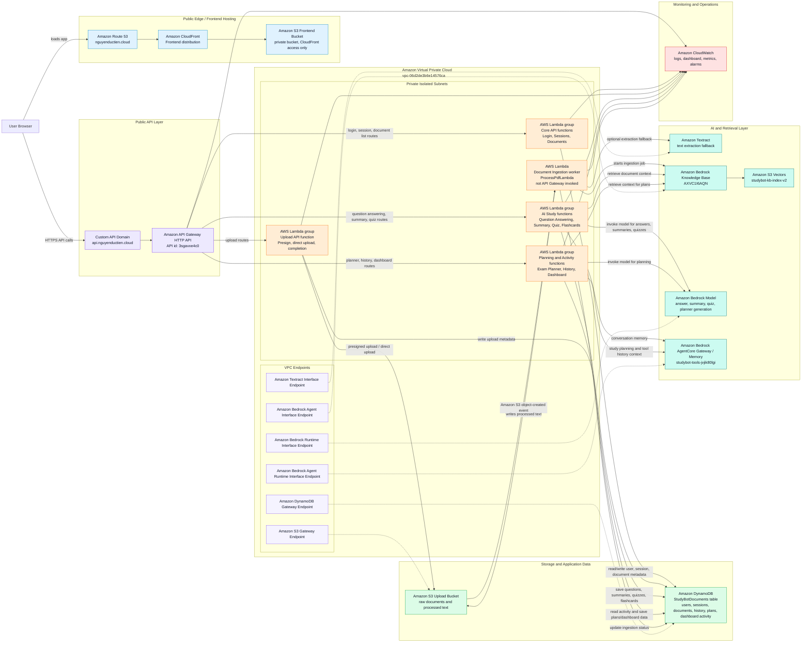

# StudyBot Architecture

This diagram is the version to use in the W7 report/demo. It separates the public edge, API layer, private Lambda layer, storage/data layer, Bedrock retrieval layer, and monitoring layer. It also shows that `ProcessPdfLambda` is not called by API Gateway; it is triggered asynchronously by S3 object-created events.

## Mermaid Diagram



## How To Read It

- The browser loads the React frontend through Route 53, CloudFront, and a private Amazon S3 frontend bucket.
- The browser calls `https://api.nguyenductien.cloud`, which routes through Amazon API Gateway HTTP API.
- API Gateway invokes the user-facing AWS Lambda functions: login, sessions, upload, documents, question answering, summary, quiz and flashcards, planner, and history/dashboard.
- `ProcessPdfLambda` is different: it is triggered by Amazon S3 object-created events after a document upload.
- The Lambda functions correlate through shared services, mainly Amazon DynamoDB, Amazon S3, Amazon Bedrock Knowledge Base, Amazon S3 Vectors, and Amazon Bedrock AgentCore.
- The private Lambda layer uses VPC endpoints to reach AWS services without needing a public NAT gateway.
- Amazon CloudWatch collects API metrics, Lambda logs, dashboard metrics, and alarms.

## Main Flows

### Frontend Load

```text
User Browser
  -> Amazon Route 53
  -> Amazon CloudFront
  -> Amazon S3 frontend bucket
  -> React StudyBot app
```

### API Request

```text
React StudyBot app
  -> api.nguyenductien.cloud
  -> Amazon API Gateway HTTP API
  -> Feature-specific AWS Lambda
  -> Amazon DynamoDB / Amazon Bedrock / Amazon S3
  -> Response to browser
```

### Document Ingestion

```text
Upload Lambda
  -> Amazon S3 upload bucket
  -> S3 object-created event
  -> ProcessPdfLambda
  -> processed text in Amazon S3
  -> Amazon Bedrock Knowledge Base ingestion
  -> Amazon S3 Vectors index
```

### Dashboard

```text
React StudyBot app
  -> GET /dashboard
  -> History and Dashboard Lambda
  -> Amazon DynamoDB recent activity
  -> topics studied this week
```

## Current Live Resource Names

- Stack: `StudyBotInfraStack`
- Status checked: `UPDATE_COMPLETE`
- Frontend: `https://nguyenductien.cloud`
- API: `https://api.nguyenductien.cloud`
- API Gateway id: `3sgavxe4c0`
- VPC: `vpc-06d2de3b6e14576ca`
- DynamoDB table: `StudyBotInfraStack-StudyBotDocuments5485FA25-OOQB8FWTKUX8`
- Upload bucket: `studybotinfrastack-studybotuploadsa01cf717-yffnnbch9sde`
- Frontend bucket: `studybotinfrastack-studybotfrontendbucket0d64d827-ve7senepf9rg`
- CloudFront domain: `d202pyjoa7b4uh.cloudfront.net`
- Bedrock Knowledge Base: `AXVC1I6AQN`
- Bedrock data source: `FHGHEZJFOY`
- S3 Vectors index: `studybot-kb-index-v2`
- AgentCore Gateway: `studybot-tools-jvjik80lgi`
- CloudWatch dashboard: `StudyBot-W7-Operations`
