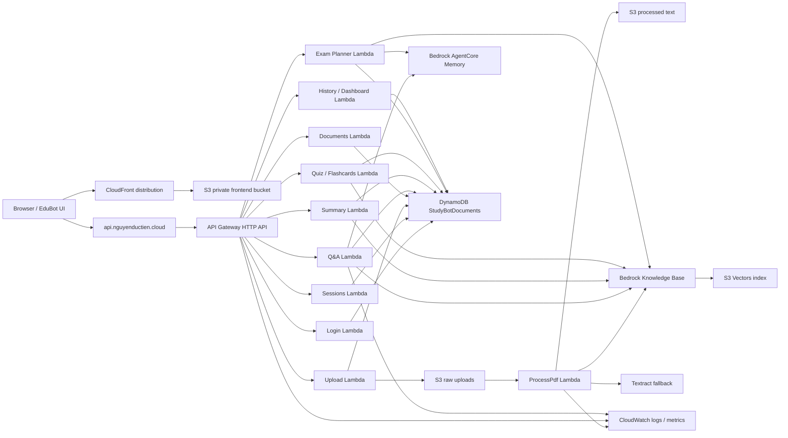

# StudyBot W7 Architecture

## Notes

- Frontend: Vite React app in `FE`, deployed to S3 behind CloudFront for `https://nguyenductien.cloud`.
- API: API Gateway HTTP API with custom domain `https://api.nguyenductien.cloud`.
- Compute: Python 3.12 Lambda functions packaged from `BE/src`.
- Data: DynamoDB single-table design keyed by `PK=USER#{user_id}` and `SK`.
- RAG: Bedrock Knowledge Base `LI32IWLOB5` with S3 Vectors index `studybot-kb-index`.
- Network: Lambdas run in private isolated subnets with VPC endpoints for S3, DynamoDB, Bedrock, Bedrock Agent Runtime, and Textract.
- Observability: CloudWatch dashboard `StudyBot-W7-Operations`, API 5XX alarm, Lambda error alarms, Q&A/ingestion duration alarms, and ingestion failure log metric.
