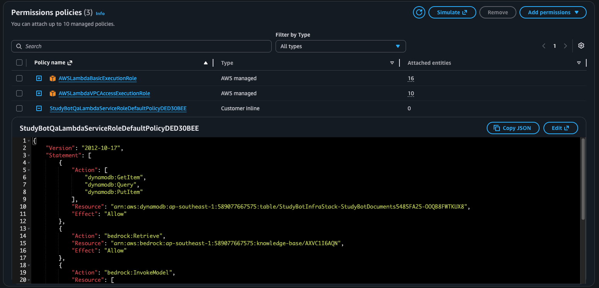

# W7 Evidence Pack

## 1. Cover

**Group:** 11

**Members**

- Nguyễn Đỗ Khánh Hưng - XB-DN26-073
- Đinh Danh Nam - XB-DN26-003
- Nguyễn Đức Tiến - XB-DN26-133
- Phạm Gia Khanh - XB-DN26-069
- Huỳnh Sỹ Thương - XB-DN26-011
- Nguyễn Duy Nghĩa - XB-DN26-049
- Nguyễn Đăng Khôi - XB-DN26-058
- Đinh Viết Quyết - XB-DN26-130
- Nguyễn Thị Huy Hoàng - XB-DN26-136

**Public URL:** <https://nguyenductien.cloud/>

**Repository:** <https://github.com/nguyenductien-qnm/W7>

**Demo video / shared submission folder:** <https://drive.google.com/drive/folders/1pABN9MzRu9GUgXRD9KjNippjSlHP2rkZ?usp=sharing>

**Domain choice:** Domain A - EduTech: AI Study Buddy

**Demo slides:** `evidence_pack/slides.pdf`

**Official demo login:** `demo@studybot.com` maps to user `demo`.

**Official demo document:** `w7-demo-photosynthesis` in session `default`,
title `W7 Demo Photosynthesis Study Guide`.

**Chosen optional capability:** **Advanced Cost Insights**.

**Total estimated spend:** approximately **USD 1.51** for the 48-hour
demo window.

## 2. Pitch and Vision

**Target users:** students, self-learners, and learners preparing for
exams or certificates.

**Use case:** StudyBot lets users upload learning documents, especially
lecture slides or PDFs with dense tables, diagrams, and mixed
formatting. The system extracts document content, creates concise
summaries, supports document-grounded chat with citations, generates
quizzes and flashcards, and helps users build study plans.

**Why this domain matters:** Students often spend too much time turning
long, static PDFs into usable revision material. StudyBot reduces that
manual effort by converting uploaded documents into summaries, testable
concepts, quizzes, and planner tasks. This makes a "dead" PDF behave
more like an interactive study source.

## 3. Architecture


**Figure 1. StudyBot deployed architecture.** The live deployment uses
CloudFront and S3 for the frontend, API Gateway HTTP API for public API
entry, Lambda for application compute, DynamoDB and S3 for state and
documents, Bedrock Knowledge Base with S3 Vectors for RAG, and
CloudWatch for operations.

### 3.1 Service Decisions

| Layer | Resource selected | Reason |
|----|----|----|
| Frontend hosting | S3 private bucket + CloudFront | Static React hosting is simple, low cost, and secure because the bucket is private and CloudFront is the public HTTPS entry point. |
| API entry layer | API Gateway HTTP API + custom domain | Lightweight route management, direct Lambda integration, and lower cost than REST API for this use case. |
| Application compute | AWS Lambda, Python 3.12 | Serverless compute fits bursty demo/classroom traffic and avoids paying for idle EC2/ECS capacity. |
| AI/RAG engine | Amazon Bedrock Knowledge Base + Amazon S3 Vectors + Amazon Nova 2 Lite | Managed retrieval, document grounding, vector storage, and model invocation inside one AWS-native flow. |
| Data persistence | DynamoDB single-table design | Fast access by user/session/document keys without managing a relational database instance. |
| Object storage | Amazon S3 | Durable storage for raw uploads and processed text, with presigned upload support and S3 event triggers. |
| Network foundation | Private isolated subnets + VPC endpoints | Lambdas stay private and AWS service calls avoid NAT Gateway cost. |
| Identity and access | IAM least-privilege roles + demo header identity | Least-privilege IAM is applied per Lambda; demo identity is intentionally scoped to the hackathon environment. |
| Observability | CloudWatch dashboard, alarms, and Logs Insights | Tracks API 5XX, Lambda errors, p95 duration, and ingestion failure signals. |
| IaC and deployment | AWS CDK stack `StudyBotInfraStack` | Infrastructure is reproducible and version-controlled. |

### 3.2 Conscious Trade-offs

**Lambda + API Gateway instead of ECS/EC2:** The team prioritized
deployment speed and pay-per-use cost for a 48-hour hackathon. The
accepted trade-off is Lambda cold start and per-invocation runtime
limits for heavier tasks.

**DynamoDB single-table instead of RDS/PostgreSQL:** The access pattern
is mainly user/session/document lookup, so DynamoDB is simpler and
cheaper at low traffic. The accepted trade-off is weaker ad hoc SQL
analytics and no relational joins.

**Demo identity instead of full Cognito:** The team used a lightweight
demo identity model to focus on the AI pipeline and end-to-end demo. The
accepted trade-off is that signup, password recovery, and
production-grade tenant isolation are future work.

## 4. Cost Discipline

### 4.1 Cost Breakdown

| Service | Estimated 48-hour workload | Estimated cost |
|----|---:|---:|
| Amazon Bedrock | Nova 2 Lite calls, embeddings, RAG retrieval, and document ingestion | ~USD 0.77 |
| VPC interface endpoints | Bedrock/Bedrock Agent/Textract private access during demo | ~USD 0.62 |
| CloudFront and S3 | Static frontend, uploaded PDFs, processed text, and vector artifacts | ~USD 0.10 |
| Lambda | Approximately 200 invocations across microservices | ~USD 0.01 |
| API Gateway | Approximately 500 HTTP API requests | \< USD 0.01 |
| DynamoDB | On-demand reads/writes for demo traffic | \< USD 0.01 |
| **Total** | Serverless-first architecture | **~USD 1.51** |

### 4.2 Observations

The two largest cost drivers are **Amazon Bedrock** and **VPC interface
endpoints**. This is expected: the serverless application layer is
almost free at hackathon scale, while AI inference, retrieval, and
private endpoint hourly charges dominate the bill.

The most important cost-control decision was using **S3 Vectors** with
Bedrock Knowledge Base instead of an always-on OpenSearch Serverless
vector store. This removes a large fixed vector-database baseline and
keeps the architecture usage-driven.

The team also avoided NAT Gateway by setting `nat_gateways=0` in the VPC
and using gateway/interface endpoints for AWS services. This reduces
fixed daily network cost and keeps Lambda traffic private.

The deployed storage uses S3-managed encryption (`AES256`) and service
defaults where appropriate. The team is not claiming a project KMS
customer-managed key for W7, so KMS is not included as a project line
item.

### 4.3 Budget Alarm Evidence

The team created a new AWS Budgets safety net specifically for the W7
project week. This is separate from the `StudyBotInfraStack` CloudWatch
alarms, because AWS Budgets monitors billing at the AWS account scope
rather than inside the application stack.

| Budget | Period | Limit | Current spend | Notifications |
|----|----|---:|---:|----|
| `StudyBot-W7-weekly-safety-net` | May 27, 2026 to June 4, 2026 | USD 100 | Actual: USD 57.289; Forecast: USD 58.837 | Email subscriber: `dinhdanhnam1@gmail.com`; actual thresholds at 50%, 80%, and 100%; forecast threshold at 100%. |

Current notification state: the 50% actual-spend notification is in
`ALARM`; the 80% actual, 100% actual, and 100% forecast notifications are
still `OK`. This gives the project a double layer of warning: AWS
Budgets controls spend, while CloudWatch alarms monitor StudyBot runtime
health.


**Figure 26. Cost Explorer evidence.** Cost Explorer is used as the
available billing evidence for the W7 project window. This screenshot
was captured Friday pre-demo on May 29, 2026, with the date range set to
May 27-29, 2026 and grouped by AWS service.


**Figure 27. Cost allocation tag activation.** The W7 project tags are
available for cost allocation, supporting filtered cost review by tags
such as `Project`, `Team`, `Owner`, and `Environment`.

Screenshot coverage:

| Requested screenshot | Evidence available |
|----|----|
| Day 1 end-of-day Cost Explorer | Not captured as a separate historical screenshot before the day ended. Current Cost Explorer still covers the May 27-29 project window. |
| Day 2 end-of-day Cost Explorer | Not captured as a separate historical screenshot before the day ended. Current Cost Explorer still covers the May 27-29 project window. |
| Friday pre-demo Cost Explorer | Captured in Figure 26. |
| Cost allocation tags | Captured in Figure 27. |

### 4.4 Tagging and Cost Allocation

The tagging strategy has two goals: make every redeployable W7 resource
easy to identify during grading/teardown, and make cost data filterable
once AWS Cost Explorer receives post-activation billing records.

Tags are applied at the CDK stack level so normal resources inherit the
same metadata during deployment. The deprecated ACM DNS validation custom
resource is excluded from tag propagation to avoid replacing the live
certificate workflow, but the infrastructure resources that matter for
cost, ownership, and cleanup are tagged.

The deployed stack uses these W7 resource tags:

| Tag | Value |
|----|----|
| `Project` | `W7Capstone` |
| `Team` | `G11` |
| `Owner` | `DinhDanhNam` |
| `Environment` | `hackathon` |

After deployment, Resource Groups Tagging API returned 49 resources with
`Project=W7Capstone` and `Team=G11`. Figure 27 shows cost allocation tag
activation in the Billing and Cost Management console, which is needed
for tag-based cost filtering after AWS cost data catches up.

Cost Explorer tag filtering can lag behind resource tagging because cost
allocation tags are not retroactive and billing data can take up to 24
hours to refresh. Therefore the evidence uses two checks together:
Resource Groups Tagging API proves the live resources are tagged, while
Figure 27 proves the tag keys are activated for future cost allocation.

### 4.5 Cost Anomaly Detection

Advanced Cost Insights is the selected optional capability. Account-level
Cost Anomaly Detection is enabled through monitor
`Default-Services-Monitor`, ARN
`arn:aws:ce::589077667575:anomalymonitor/fcaf1467-7a72-42cb-b789-47f58f6c4777`.
The subscription `Default-Services-Subscription` runs daily and sends
confirmed email alerts to `dinhdanhnam1@gmail.com` when both absolute
impact is at least USD 100 and percentage impact is at least 40%.

Cost Explorer evidence was checked from the AWS CLI on
`2026-05-28T18:53Z` UTC and supplemented with the Cost Explorer and cost
allocation tag screenshots in Figures 26 and 27. The W7 budget shows
actual spend USD 57.289 and forecast spend USD 58.837 for May 27 to
June 4, 2026.

### 4.6 Cost Per Feature

| Feature | Main AWS services | Cost behavior |
|----|----|----|
| Upload and ingestion | S3, Lambda, Bedrock Knowledge Base, S3 Vectors, optional Textract | Mostly per-document processing; local extraction avoids Textract unless needed. |
| Q&A | API Gateway, Lambda, Bedrock Knowledge Base retrieval, Nova 2 Lite | Per request; token usage dominates after retrieval. |
| Summary | API Gateway, Lambda, Bedrock retrieval, Nova 2 Lite | Per selected document and output length; summaries are capped to exam-focused output. |
| Quiz and flashcards | API Gateway, Lambda, Bedrock retrieval, Nova 2 Lite | Per generated question/card count; defaults keep count small for demo. |
| Planner | API Gateway, Lambda, DynamoDB, Bedrock retrieval/model | Per plan generation; DynamoDB writes are negligible at demo scale. |
| Frontend/static serving | CloudFront and S3 | Low fixed storage plus request/data transfer usage; no always-on frontend server. |

## 5. Security


**Figure 2. Root account MFA enabled.** The AWS root account has MFA
enabled as the account-level security baseline.

### 5.1 IAM Least Privilege

Each Lambda function uses an execution role scoped to its feature
boundary: auth, sessions, upload, documents, ingestion, Q&A, summary,
quiz, planner, and history/dashboard.

Permissions are scoped by resource ARN where possible:

- DynamoDB access is limited to the StudyBot documents table and the
  required operations.
- S3 access is split by flow: uploads write raw files, ingestion reads
  raw files and writes processed files, and AI functions read processed
  content.
- Bedrock permissions are granted only to the required model, Knowledge
  Base, and AgentCore resources.
- No AWS access keys are hardcoded in application code; Lambdas use IAM
  roles at runtime.


**Figure 3. IAM policy editor showing scoped permissions.**


**Figure 4. Login Lambda IAM policy.**


**Figure 5. Session Lambda IAM policy.**


**Figure 6. Upload Lambda IAM policy.**


**Figure 7. Documents Lambda IAM policy.**



**Figure 8. Q&A Lambda IAM policy.**


**Figure 9. Summary Lambda IAM policy.**


**Figure 10. Quiz Lambda IAM policy.**


**Figure 11. Planner Lambda IAM policy.**


**Figure 12. History Lambda IAM policy.**


**Figure 13. Process PDF Lambda IAM policy.**

### 5.2 Network Security

The Lambda functions run in private isolated subnets without public IP
addresses. Access to DynamoDB, S3, Bedrock, Bedrock Agent Runtime,
Bedrock Agent, and Textract is routed through VPC endpoints. The
frontend bucket and upload bucket both block public access; public
traffic enters through CloudFront and API Gateway.


**Figure 14. Private isolated subnets in the StudyBot VPC.**


**Figure 15. Lambda VPC configuration showing private subnet
placement.**


**Figure 16. Lambda security group configuration.**


**Figure 17. VPC endpoints for private AWS service access.**


**Figure 18. Frontend S3 bucket Block Public Access.**


**Figure 19. Upload/document S3 bucket Block Public Access.**

### 5.3 Remaining Risks and Accepted Trade-offs

The demo identity model uses `X-User-Id` and is not production-grade
authentication. It is acceptable for the W7 demo, but production should
replace it with a real identity provider such as Amazon Cognito or
another OIDC-based flow.

CORS is permissive for demo accessibility. Production should restrict
origins to the CloudFront domain.

The team accepted the extra VPC endpoint setup complexity to keep
Lambdas private, remove NAT Gateway, and reduce public egress exposure.

## 6. Monitoring and Measurement

### 6.1 Operations Dashboard

The CloudWatch dashboard is named `StudyBot-W7-Operations`. It tracks:

- API Gateway 5XX errors.
- Lambda errors across upload, ingestion, AI, planner, and history
  functions.
- p95 duration for document ingestion and Q&A.
- Ingestion failure signals extracted from ProcessPdf Lambda logs.


**Figure 20. CloudWatch operations dashboard.**

### 6.2 Alarms

The deployed stack `StudyBotInfraStack` configures sensitive demo alarms
so runtime errors become visible immediately. These are operational
CloudWatch alarms, not billing alarms:

- API Gateway 5XX sum \>= 1 in 5 minutes.
- Lambda error count \>= 1 in 5 minutes for key functions.
- Q&A p95 duration \> 45 seconds.
- Ingestion p95 duration \> 4 minutes.
- Ingestion failure log signal \>= 1.

Current stack check after the May 29 demo smoke: 11 StudyBot CloudWatch
alarms exist in `ap-southeast-1`. At least one runtime alarm is no longer
`INSUFFICIENT_DATA`: the Summary Lambda error alarm is `OK`. Other
low-traffic alarms can still show `INSUFFICIENT_DATA` when their metric
has not emitted recent data after the CDK update.

The chosen optional capability is **Advanced Cost Insights**, not Full
Observability. CloudWatch dashboard, alarms, and Logs Insights are
supporting operational evidence. The project is not claiming the Full
Observability optional path that requires custom `PutMetricData` proof.


**Figure 21. CloudWatch alarms for StudyBot.**

### 6.3 Logs Insights Query

The following query is used to inspect Lambda REPORT lines and compare
invocation count, average duration, p95 duration, max duration, and
memory usage.

``` sql
fields @timestamp, @log, @message
| filter @message like /^REPORT/
| parse @message /Duration: (?<durationMs>[0-9.]+) ms\s+Billed Duration: (?<billedMs>[0-9.]+) ms\s+Memory Size: (?<memorySizeMb>[0-9.]+) MB\s+Max Memory Used: (?<usedMemoryMb>[0-9.]+) MB/
| stats
    count(*) as invocations,
    avg(durationMs) as avg_duration_ms,
    pct(durationMs, 95) as p95_duration_ms,
    max(durationMs) as max_duration_ms,
    max(usedMemoryMb) as max_memory_used_mb
  by @log
| sort invocations desc
```


**Figure 22. CloudWatch Logs Insights result for Lambda duration and
memory.**

### 6.4 Live Verification

The latest smoke test verified the public API and main user flows
against `https://api.nguyenductien.cloud`: login, document listing,
Q&A, summary generation, quiz generation, planner clarification, planner
creation, and dashboard aggregation. The official demo login
`demo@studybot.com` returned success for user `demo`; `docs/list`
returned ready document `w7-demo-photosynthesis`; Q&A returned a grounded
answer about photosynthesis inputs and outputs with citations.

### 6.4.1 Persistent State Read-back

Persistent state is stored in DynamoDB and S3, then read back through the
public API:

| State item | Evidence |
|----|----|
| User profile | `demo@studybot.com` maps to user `demo`; `/login` returned success and token `demo-token`. |
| Session | Session `default` exists for user `demo`; smoke tests use `X-Session-Id: default`. |
| Document metadata | DynamoDB document `w7-demo-photosynthesis` is in session `default` with `kb_status=READY`. |
| Processed document | S3 key `processed/demo/default/w7-demo-photosynthesis/wiki_04_photosynthesis.txt` was ingested. |
| Fresh read-back | `GET /docs/list?user_id=demo&session_id=default` returned the ready document after deployment and ingestion. |
| Activity history | Summary, quiz, Q&A, and planner calls wrote activity that appeared in `GET /dashboard?user_id=demo&session_id=all&days=7`. |

## 6.5 Measurement and Decisions

StudyBot uses a **serverless-first** approach because the workload is
bursty: users create load only when they log in, upload documents, ask
questions, generate summaries, create quizzes, or build study plans. The
measurement objective is therefore simple: avoid idle capacity cost,
scale by request, and spend money mainly on useful
AI/document-processing work.

### 6.5.1 Rubric Decision Blocks

**DECISION 1: Use Amazon Nova 2 Lite as the generation model.**

**ALTERNATIVES CONSIDERED:** Claude 3.5 Haiku, Mistral Large 3, and
Llama 3.3 70B Instruct.

**MEASUREMENT:** Nova 2 Lite provides a 1M-token context window and 64K
maximum output, which is better aligned with long document study flows
than the shorter context/output alternatives. AWS Price List data used
for the report showed Nova 2 Lite global pricing around USD 0.30/M input
tokens and USD 2.50/M output tokens in US global routing, with Singapore
global routing around USD 0.41/M input and USD 3.39/M output. The live
demo smoke also verified that the model returned a grounded
photosynthesis answer with citations for document
`w7-demo-photosynthesis`.

**EVIDENCE:** Model configuration is in
`infra/studybot_infra/config.py`; pricing references are listed in the
References section; live API smoke passed `/ask`, `/summary`, `/quiz`,
and `/planner` against `https://api.nguyenductien.cloud`.

**TRADE-OFF ACCEPTED:** Nova 2 Lite is not the cheapest model for every
token direction, but it reduces prompt-fragmentation risk for long
study documents and keeps generation inside the AWS Bedrock stack.

**DECISION 2: Use Bedrock Knowledge Base with S3 Vectors instead of
OpenSearch Serverless or Aurora pgvector.**

**ALTERNATIVES CONSIDERED:** OpenSearch Serverless vector search and
Aurora PostgreSQL with pgvector.

**MEASUREMENT:** The deployed workload is a small hackathon document set,
so fixed baseline cost matters more than advanced vector search features.
S3 Vectors avoids an always-on OpenSearch Serverless OCU baseline. The
live Knowledge Base uses vector index `studybot-kb-index-v2`, data source
`FHGHEZJFOY`, and fixed chunking at 300 tokens with 15% overlap.
Reingestion job `KDB6GMRHAM` scanned 16 documents, indexed 16 documents,
and failed 0 documents.

**EVIDENCE:** Figure 24 shows the Bedrock Knowledge Base and S3 Vectors
setup. The deployed data source was verified through
`aws bedrock-agent get-data-source`, and the vector index ARN is exported
in `infra/outputs.json`.

**TRADE-OFF ACCEPTED:** S3 Vectors has fewer advanced search controls
than OpenSearch, but it is simpler, lower fixed-cost, and sufficient for
the W7 demo.

**DECISION 3: Use local extraction first with Textract fallback.**

**ALTERNATIVES CONSIDERED:** Textract for every page and Bedrock vision
for every page.

**MEASUREMENT:** Sample data includes mostly digital text and lecture/VTT
material, so local extraction avoids unnecessary per-page OCR cost for
extractable documents. CloudWatch p95 duration tracking is used to watch
the ingestion path, and live demo ingestion completed with 0 failed
documents for the current Knowledge Base ingestion job.

**EVIDENCE:** Figure 23 shows ingestion/Q&A p95 measurement. The
ingestion worker writes processed text to S3 under `processed/`, then
starts Bedrock Knowledge Base ingestion.

**TRADE-OFF ACCEPTED:** Local extraction can miss scanned or image-heavy
content, so Textract remains as the robustness fallback rather than the
default path.

### 6.5.2 Resource Comparison and Decisions

| Area | Selected resource | Alternatives considered | Measurement / evidence | Decision rationale |
|----|----|----|----|----|
| Compute and API | API Gateway HTTP API + AWS Lambda | EC2/ECS service behind a load balancer | Lambda pricing is request- and duration-based, so idle periods cost nearly nothing. AWS Lambda is designed to run code without provisioning or managing servers [^1]. | Selected because StudyBot traffic is intermittent and functions are naturally split by route. The trade-off is cold starts and Lambda timeout limits. |
| Database | DynamoDB on-demand | RDS/Aurora PostgreSQL | DynamoDB on-demand is pay-per-request and does not require capacity planning [^2]. | Selected because the data model is mostly user/session/document/history access by key. The trade-off is less flexibility for complex SQL analytics. |
| Frontend | S3 private bucket + CloudFront | EC2/Nginx, containerized frontend, or server-rendered app | S3 and CloudFront are usage-based and fit static React hosting. S3 is priced by storage, requests, and data transfer [^3]. | Selected because the frontend is static and does not need a running server. |
| API Gateway type | HTTP API | REST API | AWS positions HTTP APIs as lower-latency and lower-cost APIs for common use cases; API Gateway pricing is per request [^4]. | Selected because StudyBot only needs straightforward HTTP routing to Lambda. |
| Network egress | Private isolated subnets + VPC endpoints, `nat_gateways=0` | NAT Gateway for private subnet egress | NAT Gateway has hourly and data processing charges [^5]. The deployed CDK stack avoids NAT and uses VPC endpoints for AWS services. | Selected to reduce fixed cost and keep Lambda-to-AWS traffic private. |
| Vector store | Amazon S3 Vectors for Bedrock Knowledge Base | OpenSearch Serverless, Aurora pgvector | OpenSearch Serverless is powerful but has a baseline OCU cost. S3 Vectors is integrated with Bedrock Knowledge Base in the deployed stack. | Selected because the demo workload is small and benefits more from low fixed cost than advanced search features. |
| AI generation model | Amazon Nova 2 Lite | Claude 3.5 Haiku, Mistral Large 3, Llama 3.3 70B Instruct | Nova 2 Lite supports a 1M-token context window and 64K output tokens according to the AWS model card [^6]. | Selected because StudyBot needs long-document workflows, Q&A, summaries, quizzes, and planner generation at controlled cost. |

### 6.5.3 AI Model Selection

The deployed CDK configuration sets the generation model to:

``` text
global.amazon.nova-2-lite-v1:0
```

Nova 2 Lite was selected after comparing tooling fit, reasoning
capability, context length, output length, and price. The model is
especially suitable for StudyBot because the application works with long
uploaded documents and has to generate structured educational outputs.

| Model | Context / max output | Price evidence | Fit for StudyBot |
|----|---:|----|----|
| **Amazon Nova 2 Lite** | **1M context / 64K output** | AWS Price List API shows global US pricing around **USD 0.30/M input tokens** and **USD 2.50/M output tokens**; Singapore global routing is around **USD 0.41/M input** and **USD 3.39/M output** [^7]. | Best overall fit: long context, large output, AWS-native Bedrock integration, and acceptable cost for document-heavy RAG. |
| Claude 3.5 Haiku | 200K context / 8K output | Anthropic's official pricing page lists Claude 3.5 Haiku at **USD 0.80/M input tokens** and **USD 4.00/M output tokens**; AWS Bedrock provides the model card and regional availability [^8] [^9]. | Strong model quality, but smaller context/output and higher price for this workload. |
| Mistral Large 3 | Provider/model dependent | AWS Bedrock pricing includes Mistral Large 3 token pricing; AWS Price List shows US pricing around **USD 0.50/M input** and **USD 1.50/M output** for standard usage [^10]. | Lower output cost, but weaker fit than Nova 2 Lite for long-context document workflows in the current AWS-native stack. |
| Llama 3.3 70B Instruct | 128K context / 4K output | AWS Price List shows around **USD 0.72/M input** and **USD 0.72/M output** in US regions [^11]. AWS model card documents the model characteristics [^12]. | Cheap output, but context and output limits are less suitable for long documents and multi-step study plans. |

**Decision:** Nova 2 Lite is not the cheapest option in every dimension,
but it gives the best balance for StudyBot. The key reason is not only
token price; it is the combination of long context, large output
capacity, Bedrock integration, and suitable performance for educational
document workflows.

### 6.5.4 PDF Extraction Decision

StudyBot uses a layered PDF extraction strategy:

1.  Try local text extraction first with Python libraries such as
    `pdfplumber` and `pypdf`.
2.  Fall back to Amazon Textract when the document is scanned,
    image-heavy, or low-quality after text extraction.
3.  Store processed text in S3 under the `processed/` prefix and ingest
    it into Bedrock Knowledge Base.

| Alternative | Measurement | Decision |
|----|---:|----|
| Textract for every page | Predictable OCR quality, but every page incurs Textract cost and extra latency. Textract pricing is per page [^13]. | Rejected as the default because many uploaded PDFs already contain extractable text. |
| Bedrock vision for every page | Flexible but expensive and slower for page-by-page extraction. | Rejected for the default ingestion path because it spends model tokens on a task that local parsers can often solve. |
| Local extraction first, Textract fallback | Lower cost for digital PDFs; OCR is still available when needed. | Selected because it minimizes cost while preserving robustness for scanned or image-heavy documents. |


**Figure 23. Ingestion and Q&A p95 duration measurement.** CloudWatch
p95 duration is used to validate the impact of ingestion and OCR
fallback.

### 6.5.5 Vector Store Decision

The team selected **S3 Vectors** as the vector index for Bedrock
Knowledge Base instead of OpenSearch Serverless. The deployed vector
index is visible in the CDK outputs as `studybot-kb-index-v2`.

| Option | Strength | Weakness | Decision |
|----|----|----|----|
| S3 Vectors | Low operational overhead, integrated with Bedrock Knowledge Base, and suitable for small document collections. | Fewer advanced search features than OpenSearch. | Selected for the demo because fixed cost and simplicity matter most. |
| OpenSearch Serverless | Mature vector search and advanced filtering/query capability. | Higher fixed baseline cost through OCUs. | Rejected for this stage because the demo does not need always-on vector search capacity. |
| Aurora pgvector | SQL-friendly and flexible for relational workloads. | Requires database capacity and more schema/operations work. | Rejected because the app does not need relational vector workflows yet. |


**Figure 24. Bedrock Knowledge Base using S3 Vectors.**

### 6.5.6 Knowledge Base Chunking Decision

StudyBot uses tuned fixed chunking in Bedrock Knowledge Base:
**300 tokens with 15% overlap**. The deployed data source is
`studybot-kb-ds-v2` with id `FHGHEZJFOY`, and
`get-data-source` reports `maxTokens=300` and `overlapPercentage=15`.

This was chosen after measuring the sample data in `sample_data/`.
Median paragraph/cue block length was short: wiki files were mostly in
the 18-59 word median range, and the VTT lecture transcript had a median
cue block of 19 words. A 300-token chunk usually keeps one to three
related concepts together while reducing the chance that unrelated slide
topics are packed into one retrieval unit.

Semantic chunking was considered but rejected for this demo. It may
improve topic boundaries later, but switching late would add ingestion
cost and replacement risk. Fixed chunking is lower risk for the live
demo, works with both Vietnamese and English study material, and keeps
the existing `cohere.embed-multilingual-v3` embedding model and
1024-dimension S3 Vectors index unchanged.

## 7. Lessons Learned

### 7.1 What Went Well

The architecture runs end-to-end on public URLs with the core flows:
login, session creation, document upload, document listing, Q&A,
summary, quiz, planner, and dashboard.

The API is split by feature route, which made testing and debugging
easier. The `/planner/clarify` route worked well because it blocks
incomplete input before creating a study plan.

### 7.2 What We Would Do Differently

The team would measure retrieval and citation quality earlier instead of
treating HTTP 200 responses as enough proof. In the final smoke test,
the Q&A endpoint returned 200 but lacked citations for one selected demo
document, which showed that endpoint health and AI quality are separate
concerns.

The team would also prepare stronger local mocks for cloud dependencies
such as Bedrock Knowledge Base and ingestion jobs, reducing the
deploy-test-debug loop.

### 7.3 What Surprised Us

An AWS account-level Lambda concurrency limit became a real test
bottleneck when upload, ingestion, and Q&A were exercised together.


**Figure 25. AWS Lambda account concurrency limit.**

### 7.4 Customizations

The team implemented several custom features beyond the minimum flow:

- Session lifecycle: `/session/create`, `/session/list`, and
  `/session/{session_id}`.
- Quiz and flashcards through `/quiz` with `feature=quiz` or
  `feature=flashcards`.
- Multi-route planner: `/planner`, `/planner/clarify`,
  `/planner/{plan_id}`, and `/planner/{plan_id}/recommend-docs`.
- Weekly topic dashboard: `/dashboard?days=7`.
- Optional AgentCore Gateway and Memory integration for server-side tool
  workflows.

### 7.5 Real-world Parallel

Compared with production learning assistants such as Khanmigo or
NotebookLM, StudyBot still needs:

- Production authentication and tenant isolation.
- Guardrails for a multi-user education environment.
- Automated retrieval/citation quality evaluation at scale.
- Better fallback behavior when document ingestion quality is low.

## 8. Teardown Plan

Teardown is intentionally prepared but not executed before grading,
because deleting the stack would remove the live demo at
`https://nguyenductien.cloud`. The team will execute teardown after the
grader confirms the demo is complete, then attach the final deletion and
Cost Explorer proof in `docs/teardown_confirmation.md`.

Prepared teardown evidence and controls:

- The full ordered teardown checklist exists in
  `docs/teardown_confirmation.md`.
- CDK destroy command is documented and targets only
  `StudyBotInfraStack`.
- Current stack outputs identify the exact resources to verify after
  deletion: upload bucket, frontend bucket, DynamoDB table, Bedrock
  Knowledge Base, data source `FHGHEZJFOY`, S3 Vectors index, VPC,
  Lambda functions, CloudWatch alarms, CloudFront, Route 53, and ACM.
- The live stack has project tags (`Project=W7Capstone`, `Team=G11`,
  `Owner=DinhDanhNam`, `Environment=hackathon`) to make post-demo
  resource discovery easier.
- The AWS Budgets safety net and Cost Anomaly Detection subscription are
  active before teardown, so any residual spend should remain visible.
- The final proof to capture after teardown is: CloudFormation stack
  deletion status, Resource Groups Tagging API check for remaining W7
  resources, and a final Cost Explorer screenshot/CLI export showing no
  continuing W7 resource spend.

### 8.1 Ordered Teardown Checklist

1.  Stop application traffic and stop new tests.

2.  Run the main IaC teardown:

    ``` powershell
    cd infra
    cdk destroy StudyBotInfraStack
    ```

3.  Check and remove edge/domain resources if they remain:

    - CloudFront distribution.
    - API Gateway custom domain mapping.
    - Route 53 records for `api`, root, and `www`.
    - ACM certificates for frontend and API domains.

4.  Remove remaining compute:

    - Lambda functions: Login, Sessions, Upload, Documents, ProcessPdf,
      Q&A, Summary, Quiz, Planner, History.
    - Related CloudWatch log groups if complete cleanup is required.

5.  Remove remaining data resources:

    - DynamoDB table `StudyBotDocuments`.

6.  Remove remaining storage:

    - Upload bucket, including `raw/` and `processed/`.
    - Frontend bucket.

7.  Remove AI resources:

    - Bedrock data source.
    - Bedrock Knowledge Base.
    - S3 Vectors vector bucket/index.
    - AgentCore Gateway if not reused.

8.  Remove network resources:

    - VPC endpoints for S3, DynamoDB, Bedrock Runtime, Bedrock Agent
      Runtime, Bedrock Agent, and Textract.
    - Security groups.
    - Subnets and VPC.

9.  Remove IAM resources:

    - Project-specific IAM roles and policies that are not reused.

10. Final check:

- CloudFormation/CDK stack is deleted.
- Cost Explorer no longer shows increasing cost from W7 resources.

### 8.2 Useful CLI Commands

``` powershell
# Delete the CDK stack
cd infra
cdk destroy StudyBotInfraStack

# Delete the CloudFormation stack if needed
aws cloudformation delete-stack --stack-name StudyBotInfraStack

# Check stack status
aws cloudformation describe-stacks --stack-name StudyBotInfraStack

# Delete an S3 bucket and its data if anything remains
aws s3 rb s3://<bucket-name> --force

# Delete a DynamoDB table if anything remains
aws dynamodb delete-table --table-name StudyBotDocuments

# List remaining StudyBot Lambda functions
aws lambda list-functions --query "Functions[?contains(FunctionName, 'StudyBot')].FunctionName"

# List VPC endpoints for a VPC
aws ec2 describe-vpc-endpoints --filters Name=vpc-id,Values=<vpc-id>
```

## Internal Evidence Sources

- `infra/studybot_infra/config.py`: generation model ID, embedding model
  ID, Knowledge Base names.
- `infra/studybot_infra/resources_lambda.py`: Lambda memory, timeout,
  environment variables, and Bedrock model wiring.
- `infra/studybot_infra/resources_network.py`: private isolated VPC,
  `nat_gateways=0`, gateway endpoints, and interface endpoints.
- `infra/studybot_infra/resources_storage.py`: S3 buckets and DynamoDB
  on-demand table.
- `infra/studybot_infra/resources_kb.py`: Bedrock Knowledge Base, S3
  Vectors configuration, and tuned fixed chunking at 300 tokens / 15%
  overlap.
- `infra/studybot_infra/resources_observability.py`: CloudWatch
  dashboard and alarms.
- `infra/outputs.json`: deployed resource IDs, custom domains, Knowledge
  Base ID, vector index ARN, and dashboard name.

## References

[^1]: AWS Lambda pricing: <https://aws.amazon.com/lambda/pricing/>

[^2]: DynamoDB on-demand capacity mode:
    <https://docs.aws.amazon.com/amazondynamodb/latest/developerguide/on-demand-capacity-mode.html>

[^3]: Amazon S3 pricing: <https://aws.amazon.com/s3/pricing/>

[^4]: Amazon API Gateway pricing:
    <https://aws.amazon.com/api-gateway/pricing/>

[^5]: Amazon VPC pricing, including NAT Gateway and VPC endpoint
    pricing: <https://aws.amazon.com/vpc/pricing/>

[^6]: Amazon Nova 2 Lite model card for Amazon Bedrock:
    <https://docs.aws.amazon.com/bedrock/latest/userguide/model-card-amazon-nova-2-lite.html>

[^7]: AWS Price List API for Amazon Bedrock:
    <https://pricing.us-east-1.amazonaws.com/offers/v1.0/aws/AmazonBedrock/current/index.json>

[^8]: Anthropic Claude 3.5 Haiku model card for Amazon Bedrock:
    <https://docs.aws.amazon.com/bedrock/latest/userguide/model-card-anthropic-claude-3-5-haiku.html>

[^9]: Anthropic pricing: <https://www.anthropic.com/pricing>

[^10]: AWS Price List API for Amazon Bedrock:
    <https://pricing.us-east-1.amazonaws.com/offers/v1.0/aws/AmazonBedrock/current/index.json>

[^11]: AWS Price List API for Amazon Bedrock:
    <https://pricing.us-east-1.amazonaws.com/offers/v1.0/aws/AmazonBedrock/current/index.json>

[^12]: Meta Llama 3.3 70B Instruct model card for Amazon Bedrock:
    <https://docs.aws.amazon.com/bedrock/latest/userguide/model-card-meta-llama-3-3-70b-instruct.html>

[^13]: Amazon Textract pricing:
    <https://aws.amazon.com/textract/pricing/>
